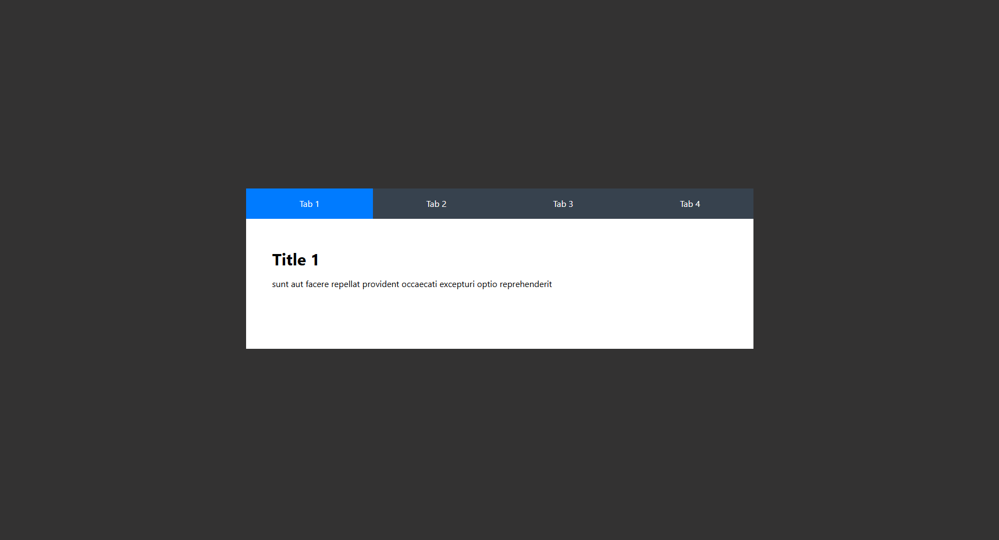

# Tabbed Interface with Custom Caching and State Management



## Project Overview

This project is a tabbed interface application that displays different data based on the selected tab. It is built with **React** and uses a **custom data provider** to handle **caching** and **state management**, in line with the requirements of a job assignment.

## Eventhough for best performance and best caching logic using a library like **`React Query`** is optimal, for this project, **custom caching and state management** were implemented instead, because of the simplicity of the project.

## Challenge

The main difficulty I faced was related to the provided REST API (`https://loripsum.net/`), which had a CORS issue that prevented me from accessing it directly. To work around this, I used the JSONPlaceholder API as a mock data source to ensure that the project functioned correctly while simulating similar data fetching needs. Other than this API limitation, the challenge was straightforward, and I was able to implement the required functionality without any other significant issues.

## Features

- **Custom Caching**: Data fetched for each tab is stored in a cache to avoid redundant network requests and improve performance.
- **State Management with Custom Data Provider**: Global state and cache management are handled through a custom provider, making data accessible across components.
- **Use the search param to manage the active tab state**:Used `useSearchParams` hook form `react-router-dom` so that the tabs function based on the URL's search parameters, enabling easy sharing and bookmarking of specific tabs!.
- **Dynamic Data Loading**: Data is fetched only when a tab is clicked, minimizing initial load times and enhancing user experience.
- **JSONPlaceholder Dummy API**: Due to CORS issues with the provided loripsum.net API, the JSONPlaceholder API was used as a replacement to fetch mock data.

## Project Structure

- **`tab_data_provider`**: A custom data provider that has custom hook (`useFetchWithCache`) that handles data fetching, caching, and cache expiration logic for each tab. It also implements retry logic to handle potential network issues.. It stores fetched data in a cache using `useRef` and provides a structured way to manage state without relying on React Context.
- **`utils/cleanUp_cache`**: A utility function that handles the clean up of the cache data if it's time is up.
- **`services/tab_services`**: A file that has the logic that hanles the fetch request from `jsonplaceholder api`.
- **`Tab`**: A component that renders the tabbed interface, fetching data for each tab using `useFetchWithCache` to access cached or newly fetched data.
- **`App`**: The main component that renders the `Tab` component.

<!-- ## Why Use a Custom Caching Solution Instead of React Query? -->

For this project, **custom caching and state management** were implemented instead of using React Query for several reasons:

1. **Assignment Requirements**: The task required to implement caching and state management. Using a custom data provider instead of an external library demonstrates a solid understanding of core React and JavaScript principles.

2. **Project Simplicity**: The project is small enough that a custom provider is a manageable solution. It keeps dependencies low while fulfilling the assignment requirements without adding unnecessary complexity.

3. **Showcasing Core Skills**: While React Query is excellent for complex projects, creating a custom solution from scratch showcases proficiency in managing caching and state without dependencies. This implementation highlights foundational skills like caching strategies, custom hooks, and asynchronous data handling.

Using a custom caching solution ensures that the project aligns with the assignment's requirements while demonstrating a thorough understanding of caching and state management.

## Installation

1. **Clone the repository**:
   ```bash
   git clone <repository-url>
   cd <repository-folder>
   ```
2. **install dependencies**:
   ```bash
   npm i
   ```
3. **start the development server**:
   ```bash
   npm run dev
   ```
4. **Open your browser and navigate to: http://localhost:3000**

## Usage

1. **Tab Navigation**: Click on any tab to load the content for that tab.
2. **Data Caching**: Each tab’s data is fetched only once and stored in a cache. When revisiting a tab, data will be loaded from the cache instead of making a new network request.
3. **Global Data Access**: All data is accessible globally through the `useFetchWithCache` custom hook, allowing components to access cached data without prop drilling.

## Code Explanation

**`useFetchWithCache`**: This custom hook handles fetching and caching for each tab. It first checks if data is cached and still valid before making a network request. If not, it will fetch new data, cache it, and handle retry logic in case of network errors.

**`use_custom_cache`**:
This custom hook is designed to use the `useFetchWithCache`for data fetching with caching for a specific tabId and it also handles the loading and error state. This hook can be used in any component that needs to fetch tabData with caching by providing a tabId.

**`tab.tsx`**:
This component renders the tabbed interface. When a tab is clicked, it uses useFetchWithCache to fetch data for that tab, showing a loading state, cached data, or error messages depending on the fetch status.

**`fetchWithCache`**:
A fetcher function to manage cache with invalidation and retry logic.
